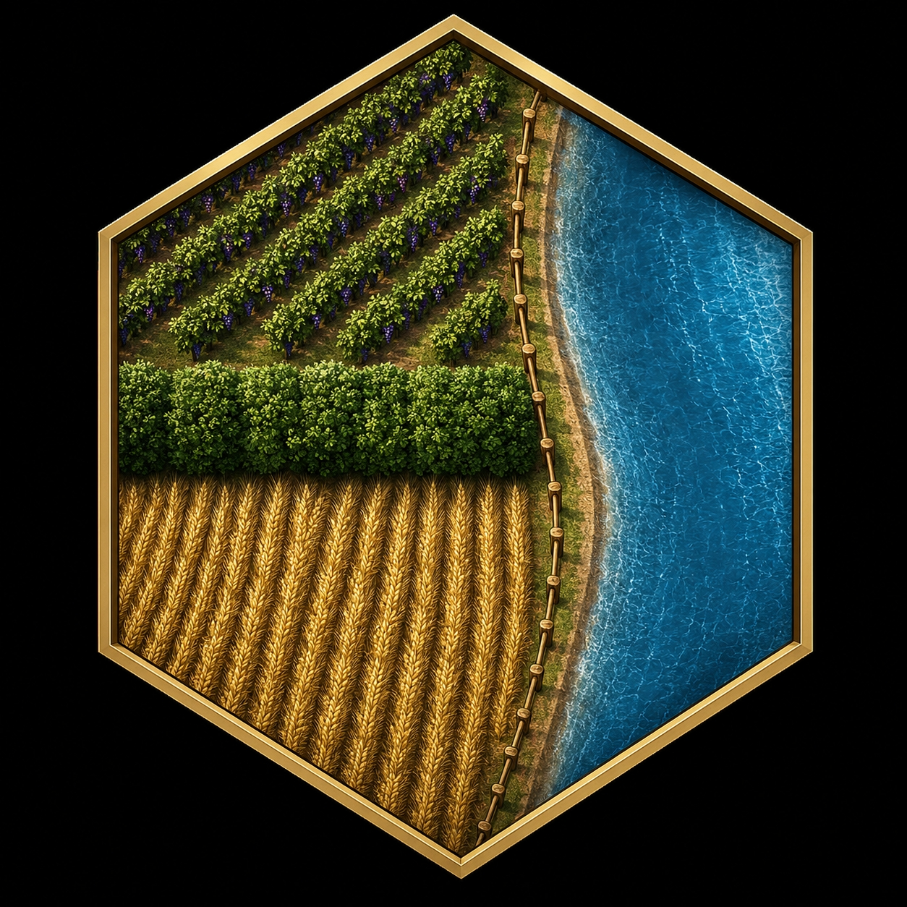

  

# Qui nous sommes :
[Insérez votre description ici]

## Nos Réseaux :

  
  
  

## Nos Projets :
Voici ce que nous avons fait :
- [App Dev Studio](https://floodfield-sudio.github.io/Dev-Studio/), *in-dev 0.1.3 bêta public*
- [Mod MC Admin Tool](https://floodfield-sudio.github.io/Admin-Tool/), *stable 1.0.1 public*
- War Conflict, *in-dev 0.0.6 alpha privé*
